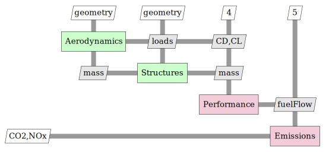

# mdax-emissions

This repository the tool input and output definitions for a simple workflow example.  

To get an impression of the tools a generated workflow, see [examples](./example/html).

For comments or feedback contact us at [andreas.pagerisueno@dlr.de](mailto:andreas.pagerisueno@dlr.de).

